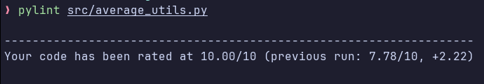
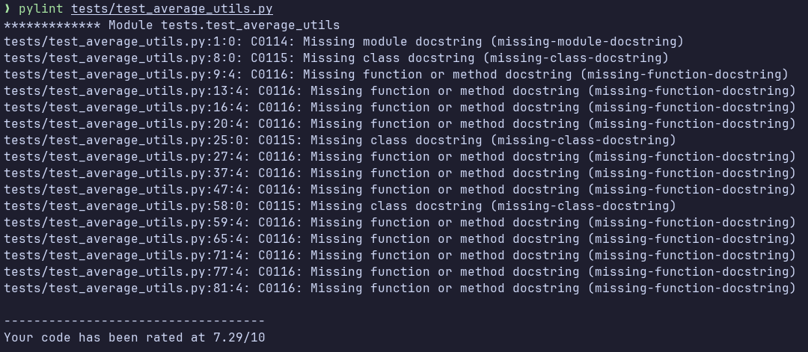
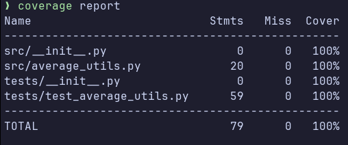

# Отчет о выполнении задания 6-ого семинара.

## Объяснение кода

Этот код представляет собой набор тестов для проверки функциональности класса AverageUtils, который, определен в файле average_utils.py. Класс AverageUtils предоставляет методы для вычисления среднего значения списка и сравнения средних значений двух списков.

## TestUnitFindAverage 
### Этот класс содержит тесты для метода find_average класса AverageUtils.
1. test_find_average: Проверяет, что метод правильно вычисляет среднее значение для списка чисел.
2. test_find_average_empty_list: Проверяет, что метод возвращает 0 для пустого списка.
3. test_find_average_raises_on_not_list: Проверяет, что метод вызывает исключение TypeError, если передан аргумент, не являющийся списком.
4. test_find_average_raises_on_not_numbers: Проверяет, что метод вызывает исключение TypeError, если в списке есть элементы, не являющиеся числами.
## TestUnitCompareAverage
### Этот класс содержит тесты для метода compare_average класса AverageUtils.
1. test_compare_average_equals: Проверяет, что метод сравнения правильно обрабатывает случай, когда средние значения равны.
2. test_compare_average_greater: Проверяет, что метод сравнения правильно обрабатывает случай, когда среднее значение первого списка больше.
3. test_compare_average_less: Проверяет, что метод сравнения правильно обрабатывает случай, когда среднее значение второго списка больше.
## TestIntegration
### Этот класс содержит тесты, которые интегрируют более одного метода из AverageUtils.
1. Тесты test_compare_average_equals, test_compare_average_greater, test_compare_average_less проверяют, что метод интегрированного сравнения работает правильно.
2. test_compare_average_raises_on_not_list: Проверяет, что метод вызывает исключение TypeError, если хотя бы один из аргументов не является списком.
3. test_compare_average_raises_on_not_numbers: Проверяет, что метод вызывает исключение TypeError, если в хотя бы одном из списков есть элементы, не являющиеся числами.
### В каждом тесте используются assert утверждения для проверки правильности работы методов и корректности вывода. Также используется библиотека pytest для удобного написания тестов. Модуль unittest.mock используется для создания мок-объектов (заменителей) при тестировании, чтобы изолировать код от внешних зависимостей.
## Отчет pylint

Отчет для файла `src/average_utils.py`

Отчет для файла `tests/test_average_utils.py`

## Отчет о покрытии тестами coverage

 